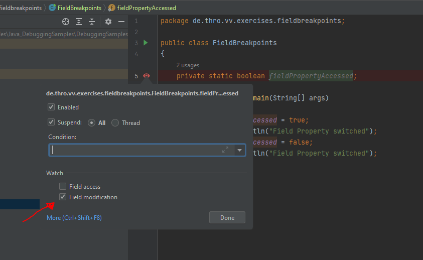
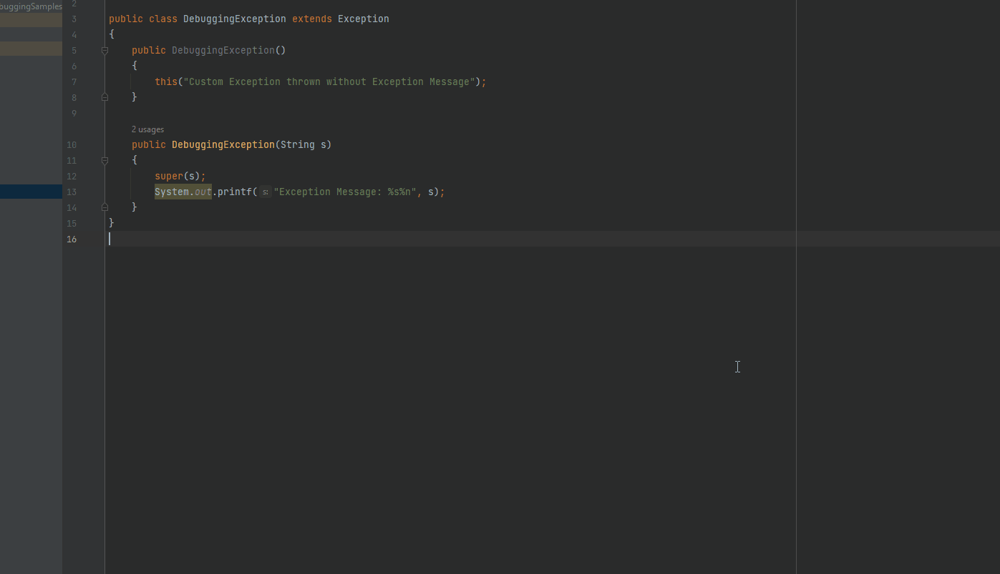
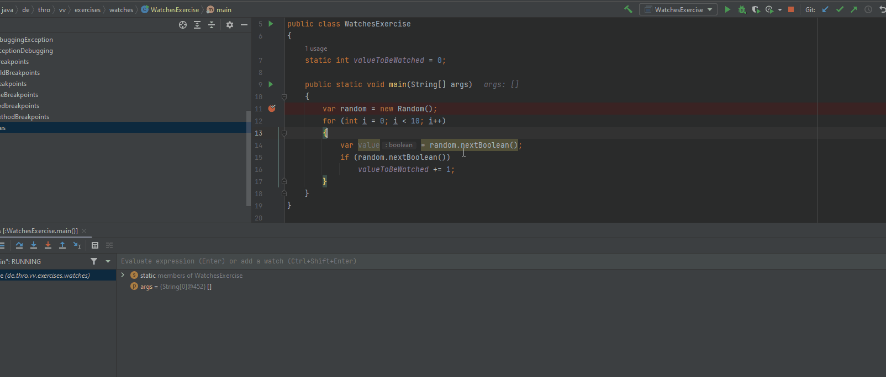

# DebuggingSamples

Sample repository with code snippets to practice debugging with IntelliJ IDEA

# Examples

## Breakpoints

Breakpoints are special markers in the development environment that stop regular program execution at a desired point. This allows the developer to examine the program state and behavior to detect errors and incorrect behavior.

### Types of breakpoints

The following types of breakpoints are available in IntelliJ IDEA:
(vgl. <a href="https://www.jetbrains.com/help/idea/using-breakpoints.html#set-breakpoints">JetBrains Reference</a>)

- Line Breakpoints: Suspend the program upon reaching the line of code where the breakpoint was set. This type of breakpoints can be set on any executable line of code. 

  

- Method Breakpoints: Suspend the program upon entering or exiting the specified method or one of its implementations, allowing you to check the method's entry/exit conditions.    
  
- Field Watchpoints: To detect access and modification of fields if caller source is unknown.    
  
- Exception Breakpoints:
  Hold application if specific exception occurs

      > CTRL + SHIFT + F8  --> View Breakpoints, ALT + Insert (Exception)

    

    Alternatively, check "Any Exception" to stop the application if an exception occurs.

### Conditional Debugging

Hit breakpoint only if the specified condition is met.
Especially useful for loops.

## Watches
Add any variable as Watch. This value then remains fixed in the "Debugger window".

## RemoveOnceHit

Sometimes a one time breakpoint is useful. For example if the developer has to be sure his method is hit from the correct method. Set the 'Remove Once Hit' Checkbox.    

# Tipps and Tricks

### Named Breakpoints

Sometimes a lot of breakpoints are needed to understand the correct behavior of the application. The developer can quickly lose the overview and gets stuck on "wrong" breakpoints.   
The breakpoints can be easily "sorted" here and grouped per feature / package.
For example, for the "Exception Feature" under point 1) all breakpoints of this feature can be deactivated with one action.
Point 2) demonstrates the named breakpoints.

## IntelliJ IDEA Shortcuts

> Toggle line/method/field Breakpoint Shortcut --> CTRL + F8
>
> Edit breakpoint properties --> CTRL + SHIFT + F8
>
> Further settings with --> CTRL + SHIFT + F8
>
> Step further --> F8
>
> Run to next breakpoint --> F9

## Google Search Engine

- Use Placeholder:

  > ### Wrong
  >
  > > could not cast value of type DemoHomeClass to DemoClass
  > >
  > > > About 7 results (0,56 seconds)
  >
  > ### Better:
  >
  > > Could not cast value of type _ to type _
  > >
  > > > About 1.550.000.000 results (0,51 seconds)
  >
  > ### Further Improvement:
  >
  > > site: stackoverflow.com solved Could not cast value of type _ to type _
  > >
  > > > About 4.420.000 results (1,02 seconds) --> StackOverflow Entry with solved question is first result

- Exclude Search Results:

  > Mustang -Car Ford
  >
  > > Show only horse results

- Must Have Search Terms:

  > Mustang "Ford"
  >
  > > Will search for Cars, excluded horses

- Combinations:
  > -site: udemy "java spring boot"
  >
  > > Show results for Java Spring Boot Courses on Udemy
  >
  > -site: udemy "java RestApi\*"
  >
  > > Search on Udemy for Java RestAPI results
  >
  > blog: java spring boot "jpa" 2020..2022
  >
  > > Search for blog entries that can contain java spring boot and must contain "JPA" in the period from 2020 to 2022.

# Exercises

Clone this Repository: <a href="https://github.com/Thomas-Mildner/DebuggingSamples">https://github.com/Thomas-Mildner/DebuggingSamples</a> 

- LineBreakpoints: _de.thro.vv.exercises.linebreakpoints.LineBreakpoints --> Main_ 
- MethodBreakpoints: _de.thro.vv.exercises.methodbreakpoints.MethodBreakpoints --> Main_ 
- FieldBreakpoints: _de.thro.vv.exercises.fieldbreakpoints.FieldBreakpoints --> Main_ 
- ConditionalDebugging: _de.thro.vv.exercises.conditionaldebugging.ConditionalDebugging --> Main_ 
- ExceptionDebugging: _de.thro.vv.exercises.exceptions.ExceptionDebugging --> Main_  
